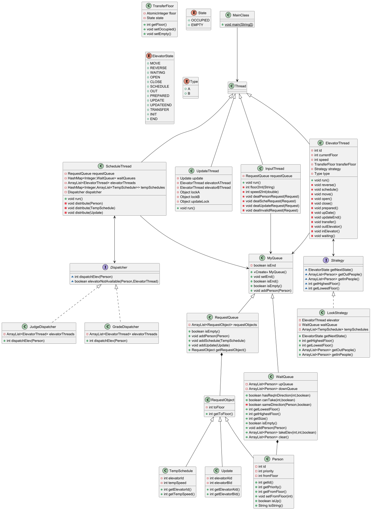
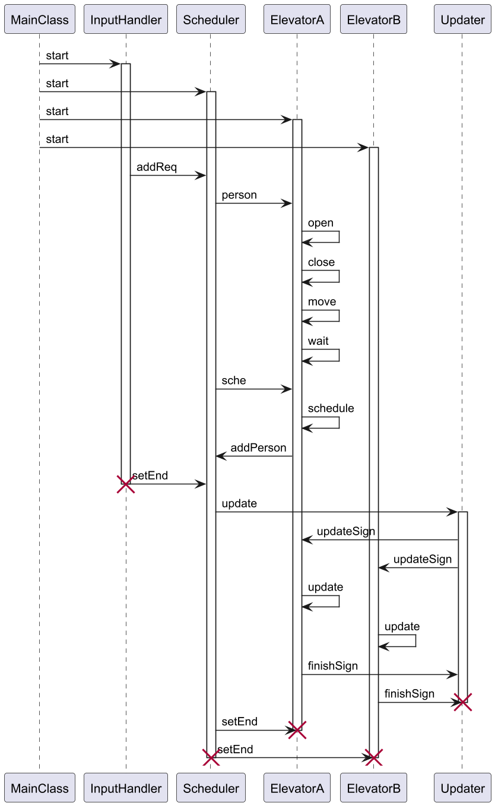

# 一、程序的架构与迭代 #

## 1、UML类图 ##



*注：删除了部分方法和成员变量*

## 2、UML协作图 ##



## 3、类说明 ##

| 名称 | 类型 | 功能 |
| :---: | :---: | :---:|
|$MainClass$|类|程序的入口|
|$InputThread$|类|输入处理线程|
|$ScheduleThread$|类|调度线程|
|$ElevatorThread$|类|电梯运行线程|
|$UpdateThread$|类|双轿厢升级线程|
|$Dispatcher$|接口|调度器|
|$JudegeDispatcher$|类|调度器实现类|
|$GradeDispatcher$|类|调度器实现类|
|$Strategy$|接口|电梯运行策略|
|$LookStrategy$|类|电梯运行策略实现类|
|$MyQueue$|类|队列父类|
|$RequsetQueue$|类|请求队列|
|$WaitQueue$|类|电梯等待队列|
|$RequestObject$|类|请求对象父类|
|$Person$|类|乘客|
|$TempSchedule$|类|临时调度|
|$Update$|类|双轿厢升级|
|$ElevatorState$|枚举|电梯状态|
|$TransforFloor$|类|换乘楼层|

## 4、作业迭代 ##

### 第一次作业 ###

- 做第一次作业的时候我对多线程一无所知，上网找资料被线程池、<code>Future</code>类、<code>Callable</code>接口、<code>Runnable</code>接口、<code>Thread</code>类、信号量、读写锁、公平锁、<code>synchronized</code>、死锁、轮询弄得头晕目眩，看两天也没看明白这次作业该怎么写。后来发现其中大部分我到这单元结束都没用到，第一次作业的整体框架基本依照第三次练习。

- 整体的框架依照“**生产者——消费者**”模型，分成了主线程，即<code>MainClass</code>、输入线程、分派（调度）线程和电梯线程。

- 我也仿照第三次练习将队列分为请求队列和电梯等待队列，尽量让一个类只负责一件事，遵从单一职责原则。然后我给这两个类提供了一个父类<code>MyQueue</code>，把这两个类相似的部分放在一起，不过这个设计到最后都没有起到太大的帮助，但勉强也算符合面向对象的原则，把每个类都设计的短小。

```Java
public class MyQueue {
    private boolean isEnd;

    public MyQueue() {
        isEnd = false;
    }

    public synchronized void setEnd() {
        isEnd = true;
        notifyAll();
    }

    public synchronized boolean isEnd() {
        notifyAll();
        return isEnd;
    }

    // 在子类被重写
    public synchronized boolean isEmpty() {
        notifyAll();
        return false;
    }

    // 在子类被重写
    public synchronized void addPerson(Person person) {
        notifyAll();
    }
}
```

- 我的电梯线程会从<code>Strategy</code>类（在后续的迭代中才被改为接口）获取下一次的状态来更新自身状态，同时也会获取进出电梯的人。但是这次作业的实现中一部分状态仍会由电梯自身来判断，解耦不够，电梯负责的职责不单一，增加了设计和Debug的难度

### 第二次作业 ###

第二次作业新增了临时调度和Receive约束，同时取消乘客指定电梯的约束，需要自行设计电梯分配策略。

- 在这一次作业中，我对上一次作业的架构进行了重构，一方面是上一次作业策略类的实现过于繁琐，在Look策略的基础上加上了一些自己不成熟的想法，让代码更加复杂，难以维护；另一方面也是作业迭代的需要。我将原来的<code>Strategy</code>类转为一个接口，提供一些方法让具体的策略类如<code>LookStrategy</code>来是实现，电梯的分配策略也在<code>ScheduleThread</code>中实现，让<code>ScheduleThread</code>调用<code>Dispatcher</code>接口，具体的分配策略也让<code>Dispatcher</code>接口的实现类如<code>JudegeDispatcher</code>等来实现。这样一来，<code>ScheduleThread</code>只需要知道<code>Dispatcher</code>接口，不需要知道具体的实现类，实现了依赖倒置原则，同时也让代码更加模块化，易于维护，<code>ElevatorThread</code>类也是同理。之后如果想要更换策略的时候也只需新建一个类来实现对应接口即可。

```Java
// Strategy.java
import java.util.ArrayList;

public interface Strategy {
    ElevatorState getNextState(); // 获取电梯下一个状态

    ArrayList<Person> getOutPeople(); // 获取出电梯的人

    ArrayList<Person> getInPeople(); // 获取进电梯的人
}
// Dispatcher.java
public interface Dispatcher {
    int dispatchElev(Person person); // 分配电梯
}
```

- 对于Receive约束，我都是在<code>ScheduleThread</code>分配完电梯后输出，而不是在<code>Dispatcher</code>接口的实现类中输出，这样只需由接口实现类返回适合的电梯Id（如果都不合适返回-1），<code>ScheduleThread</code>来判断是否该输出Receive，不需要提供给接口实现类更多的信息，降低了两个类之间的耦合程度。

- 在这次作业我也重构了<code>ElevatorThread</code>类，主要修改的是电梯线程重写的<code>run</code>方法，更改电梯的一些状态以适应我新的电梯运行策略。这样一来，电梯只需向策略类获取自己下一步的状态，根据状态执行对应的方法即可，优化了原有的逻辑，让电梯线程专注于自己的工作，做一个**执行者**而不是决策者。对于后续进一步优化逻辑，或许可以考虑面向对象设计的**命令模式**，它行为一种设计模式，将请求或操作封装为对象，可以参数化其他对象使用不同的请求、队列或日志请求，并支持可撤销的操作。具体思路类似于上学期OOPre的**工厂模式**。

```Java
    // ElevatorThread.java
    @Override
    public void run() {
        while (true) {
            ElevatorState state = strategy.getNextState();
            if (state.equals(ElevatorState.END)) {
                break;
            } else if (state.equals(ElevatorState.OPEN)) {
                open();
            } else if (state.equals(ElevatorState.CLOSE)) {
                close();
            } else if (state.equals(ElevatorState.MOVE)) {
                move();
            } else if (state.equals(ElevatorState.REVERSE)) {
                reverse();
            } else if (state.equals(ElevatorState.WAITING)) {
                waiting();
            } else if (state.equals(ElevatorState.SCHEDULE)) {
                schedule();
            } else {
                System.out.println("At ElevatorThread.run() unknown state" + state);
            }
        }
    }

```

*注：电梯分配见后文调度策略*

### 第三次作业 ###

第三次作业新增了双轿厢电梯的升级改造。

- 对于电梯的升级，我新增了一个线程<code>UpdateThread</code>。<code>ScheduleThread</code>获取升级请求，并将请求和对应电梯线程交给<code>UpdateThread</code>进行后续操作。

*注：双轿厢电梯具体的实现策略见后文双轿厢电梯*

### 未来可能的迭代开发 ###

- 对于未来的迭代开发，可能加入不同类型的电梯，此时可以更改原有的架构，新建一个电梯父类<code>Elevator</code>，让<code>NormalElevator</code>、<code>DoubleElevator</code>等子类来继承它，以实现不同类型的电梯，同时让电梯线程<code>ElevatorThread</code>获取对应的电梯子类和策略类，这样将电梯的属性与行为解耦，提高代码的可扩展性和稳定性。

# 二、同步块与锁 #

说起来惭愧，在第一次作业中，我对<code>synchronized</code>、<code>wait</code>和<code>notifyAll</code>的理解比较浅显，也不知道具体该如何使用，所以使用到这些的地方我都基本照搬第三次练习和学长的
代码，虽然侥幸通过了强测与互测，但是我这次作业中留下了许多不必要的<code>synchronized</code>，大部分加锁都是对方法加锁，也即对具体的实例对象（this）加锁。

在第二次作业的完成过程中，我逐渐对<code>synchronized</code>、<code>wait</code>和<code>notifyAll</code>有了更深的理解，也学会了如何使用它们。我厘清了不同线程之间对资源的共享，电梯线程和调度线程共享等待队列<code>WaitQueue</code>，当调度线程向相应的电梯线程添加乘客时，其应该唤醒可能处于等待状态的电梯线程，所以让他们共用一把锁$lock_i$来进行线程间的协作。同时，在第二次作业中，我的电梯线程不只承担消费者的功能，当他收到临时调度请求后，他会将已经Receive的乘客全部返还给电梯线程，所以电梯线程与调度线程也共享<code>RequestQueue</code>。当调度线程分配完请求进入等待状态时，我让其在<code>requestQueue</code>上等待，电梯线程产生请求后通知所有在<code>requestQueue</code>上等待的线程（只会有<code>ScheduleThread</code>），这样调度线程就可以继续分配请求。但是这里更好的选择是让电梯线程和调度线程共享一个新的锁<code>requestLock</code>。因为我的<code>requestQueue</code>本身也有加上<code>synchronized</code>的方法，这样会加剧多个线程竞争一把锁，这也直接导致了我在第三次强测中的错误。

```Java
    // 对requestQueue加锁
    // ScheduleThread.java
    private final RequestQueue requestQueue;
    @Override
    public void run() {
        while (true) {
            // todo
            if (/*请求队列为空*/) {
                synchronized (requestQueue) {
                    try {
                        requestQueue.wait();
                    } catch (InterruptedException e) {
                        throw new RuntimeException(e);
                    }
                }
            }
            // todo
        }
    }

    // ElevatorThread.java
    private final RequestQueue requestQueue;
    private void schedule() {
        //todo
        synchronized (requestQueue) {
            requestQueue.notifyAll();
        }  
    }
    private void outElevator() {
        // todo
        synchronized (requestQueue) {
            requestQueue.notifyAll();
        }
        
    }

    // 对lock加锁
    // ScheduleThread.java
    private final HashMap<Integer,Object> locks;
    private void distribute() {
        // todo
        int elevatorId = schedule.getElevatorId();
        synchronized (locks.get(elevatorId)) {
            // todo
            locks.get(elevatorId).notifyAll();
        }
    }

    // ElevatorThread.java
    private final Object lock;
    private void waiting() {
        synchronized (lock) {
            try {
                lock.wait();
            } catch (InterruptedException e) {
                throw new RuntimeException();
            }
        }
    }
```

同时，因为电梯线程和调度线程要共享电梯返回的乘客，所以我在电梯线程中添加了<code>pendingLock</code>来保证线程安全。之所以单独设计一个<code>pendingPeople</code>来转运乘客请求回调度线程，再加入<code>requestQueue</code>，也是阻止电梯线程对<code>requestQueue</code>的直接修改，同时避免潜在的线程危险。

```Java
public class ElevatorThread extends Thread {
    private final Object pendingLock = new Object();
    private ArrayList<Person> pendingPeople = new ArrayList<>();

    private void schedule() {
        synchronized (pendingLock) {
            // todo
        }
    }

    private void outElevator() {
        synchronized (pendingLock) {
            // todo
        }
    }

    public boolean isEmpty() {
        synchronized (pendingLock) {
            return currentPeople.isEmpty() && pendingPeople.isEmpty() && waitQueue.isEmpty();
        }
    }

    public ArrayList<Person> sendPendingPeople() {
        synchronized (pendingLock) {
            ArrayList<Person> tem = pendingPeople;
            pendingPeople = new ArrayList<>();
            return tem;
        }
    }
}
```

在我用自己搭建评测机检查代码时，我还发现了一个线程不安全的漏洞。就是在<code>ScheduleThread</code>分配电梯时，整个过程并不是原子的，这就导致我在判断电梯不处于临时调度后选择它作为分配的目标，而下一刻电梯线程进入临时调度输出“begin”，在之后又输出“Receive”。所以我为这个操作加上了<code>sharedLock</code>来确保**原子性**，保证在“Receive”之前电梯线程不会输出“begin”。期间我其实也尝试了**公平锁**，后来发现这也是治标不治本，就还是继续使用<code>synchronized</code>和普通的锁。

```Java
    // ScheduleThread.java
    private void distribute(Person person) {
        synchronized (sharedLock) {
            if (!isScheduled) {
                // todo
            }
            // todo
            TimableOutput.println("RECEIVE-" + person.getId() + "-" + elevatorId);
        }
    }
    // ElevatorThread.java
    private void schedule() {
        synchronized (sharedLock) {
            isScheduled = true;
            // todo
            TimableOutput.println("SCHE-BEGIN-" + id);
        }
    }
```

除此之外我在这次作业一开始尝试用**读写锁**，后来考虑到读操作并不频繁，同时读的操作几乎不存在，加入读写锁反而增加了性能开销，所以我最后还是放弃了这个想法。

第三次作业因为新增了一个<code>UpdateThread</code>，所以我用<code>updateLock</code>来控制升级线程与电梯线程的协作。

```Java
    // UpdateThread.java
    @Override
    public void run() {
        // todo
        while (/*未达到开始条件*/) {
            // updateLock应该放在while之外，因为有可能在判断条件不成立后电梯状态被修改提前notify导致UpdateThread线程一直空等，造成死锁，所幸我的设计让这种情况很难发生，第三次作业强测互测都没被找出这个地方的bug
            synchronized (updateLock) {
                try {
                    updateLock.wait();
                } catch (InterruptedException e) {
                    throw new RuntimeException(e);
                }
            }
        }
        // todo
    }
    // ElevatorThread.java
    private void updatePrepare() {
        Object lock = this.updateLock;
        // 因为IDEA不允许在非final对象上加锁，我的updateLock也不可能在类的实例化时确定，只能出此下策
        synchronized (lock) {
            lock.notifyAll();
        }

    }
```

*~~注:其实也可以在初始化时实例化15($C^2_6$)个Object对象~~*

*注：对双轿厢电梯换乘楼层的同步处理见后文双轿厢电梯*

# 三、调度策略 #

## 1、电梯运行策略 ##

在第一次作业中我自己设计了一种运行策略，主要的想法就是让电梯去接离自己最近的人或前往最近的乘客目标层。简单来说，就是哪里近去哪里。这种**自以为是的异想天开**不仅让我的策略类多了很多冗余的逻辑来判断最近的目标楼层，也让电梯线程的运行逻辑变得复杂难于预测，增加了Debug的难度，最终在强测也成功获得了较低的性能分。本来想在一众Look策略中脱颖而出，另辟蹊径拿下性能分，结果事后看来实在是痴心妄想。

所以我在第二次作业中还是选择了Look策略，毕竟生活中大部分电梯都采用这个策略，往届学长也多使用这个策略。作为大多数人的选择，就算不是最优的，也一定是最均衡的。

我实现的Look策略是最朴素的Look策略，如果电梯没有收到请求就等待；反之，如果当前电梯运行方向上有人或者有乘客想下车，就继续沿这个方向运行，否则就调转方向。沿途只有顺路的乘客可以上车。这种策略选择大大优化了我代码的复杂程度，使电梯运行逻辑变得更加清晰。

```Java
    // LookStrategy.java
    public ElevatorState getNextState() {
        if (/*收到临时调度请求*/) {
            return schedule();
        }

        if (/*电梯门开着*/) {
            return /*电梯门可以关闭*/ ? ElevatorState.CLOSE : ElevatorState.WAITING;
        }

        if (/*电梯门可以打开*/) {
            return ElevatorState.OPEN;
        }

        if (/*电梯不为空*/) {
            return /*掉头信号*/ ? ElevatorState.REVERSE : ElevatorState.MOVE;
        } else {
            if (/*有人在等待队列*/) {
                return /*等待队列结束*/ ? ElevatorState.END : ElevatorState.WAITING;
            } else {
                return /*同方向有请求*/ ? ElevatorState.MOVE : ElevatorState.REVERSE;
            }
        }
    }
```

其实这次作业中我也尝试过实现量子电梯进一步优化性能，因为可能导致更多的bug，而且与我的一些实现冲突，大部分时间又耗在搭评测机和Debug上，所以最后还是放弃了这个想法。

还有一种优化思路时，是在电梯人较少的时候，电梯顺路捎上与电梯运行方向反方向的乘客来提高效率。但是因为下一刻可能突然来了很多乘客，所以电梯“人较少”是一个不确定的状态，提前让不同方向的乘客上电梯反而占用了本来应该上电梯的乘客的资源，反而导致效率下降，因此我也没有实现这个想法。

对于高优先级乘客的选择，我只是在乘客上电梯时对等待队列按优先级排序，高优先级先上电梯。事实上还可以，在电梯开门时让所有人下车，再对这一楼层的人按优先级排序上电梯，这样其实就是在电梯满员时让优先级更高的人上电梯，不过我到最后也没实现这个小设计。

在第三次作业中我也是沿用了Look策略没有进行修改。

## 2、电梯分配策略 ##

从第二次作业开始，我们需要自己实现电梯的分配策略。

我第二次作业的分配策略是**平均分配**，与一般模六加一的设计不同，我是选择乘客队列人数（电梯里和电梯外的总人数）的进行分配，并且限制同一个电梯最多同时处理20个请求，避免一个电梯的运输压力过大。这种设计优点是实现简单，缺点也显而易见，性能较低，我在强测中设置没有分数超过97的测试点，超过96的也只有两个测试点，大部分集中在95附近。

```Java
    // JudgeDispatcher.java
    public int dispatchElev(Person person) {
        int elevatorId = 1;
        int minSize = 200; //* 乘客最多100人
        for (ElevatorThread elevator : elevatorThreads) {
            if (elevatorNotAvailable(person, elevator)) {
                continue;
            }
            if (elevator.getSize() < minSize) {
                elevatorId = elevator.getElevatorId();
                minSize = elevator.getSize();
            }
        }

        return minSize == 200 ? -1 : elevatorId;
    }
```

所以我在第三次作业尝试了另一个分配策略。这个策略主要是估算一个电梯接到某位乘客所需要的时间，思路来源于[这位学长的博客作业](https://blog.csdn.net/m0_73580155/article/details/137956584?ops_request_misc=%257B%2522request%255Fid%2522%253A%25221e25ddaa3e0401e7926d3805a0cd1548%2522%252C%2522scm%2522%253A%252220140713.130102334.pc%255Fall.%2522%257D&request_id=1e25ddaa3e0401e7926d3805a0cd1548&biz_id=0&utm_medium=distribute.pc_search_result.none-task-blog-2~all~first_rank_ecpm_v1~rank_v31_ecpm-4-137956584-null-null.142^v102^pc_search_result_base1&utm_term=OO%E6%89%93%E5%88%86%E7%AD%96%E7%95%A5&spm=1018.2226.3001.4187)，这种思路类似于打分策略，但是只考虑电梯接到乘客的时间这一种要素，不需要进行调参，实现起来也不复杂。而在电梯运行时间更短的情况下，电梯的耗电量在经验上也会趋向更少。

```Java
    //ElevatorThread.java
    public int getMoveTime(Person person) {
        int moveTime = 0;
        int speed = isUpdated ? 1 : 2;

        if (/*电梯为空*/) {
            floor = /*电梯当前位置与乘客的距离*/;
        } else {
            if (/*电梯和乘客同向*/) {
                if (/*乘客在电梯前*/) {
                    floor = /*电梯当前位置与乘客的距离*/;
                } else {
                    if (/*电梯向上*/) {
                        floor = // todo
                    } else {
                        floor = // todo
                    }
                }
            } else {
                if (/*电梯向上*/) {
                    floor = // todo
                } else {
                    floor = // todo
                }
            }
        }
        moveTime += speed * floor;
        if (/*需要换乘*/) {
            moveTime += 2;
        }

        return moveTime;
    }
```

在实际测试中，我发现这个策略的耗时并没有比平均分配更优，有时候反而性能更差。后来我发现问题出现在我的这个模型太过简略，没有考虑到电梯开门花费的时间，这让本来就有些误差的估计与真实情况的差异更大。所以，我尝试模拟电梯开门的次数。起初，我打算遍历电梯请求队列来计算乘客所以的楼层数，但是这种方法比较复杂，需要引入更多的函数方法来实现这个想法。

后来，我发现这就是一个数学模型，电梯要去的最高楼层为max，要去的最低楼层为min，这段楼层之间等待转运的乘客数为x，我们需要求出电梯可能的开门次数（乘客所在的不同楼层数）。我们发现乘客的分布是近似完全随机的（除了某些特殊的数据点），这就是一个典型的球与小盒问题，乘客是球，楼层是盒子。球随机分布在盒子中，乘客随机分布在楼层中。具体的公式如下

$n = max - min + 1$

$E_{楼层} = n * (1 - (1 - 1/n)^x)$

调整后的策略在第三次强测取得了不错的成绩，通过的测试点分数提高到了98分作业。当然这个策略也有一些漏洞，一是电梯计算移动时间是根据当前的状态来求值，如果下一刻电梯突然掉头，计算结果就会有较大误差。同时，一辆双轿厢电梯如果比另一辆普通电梯耗时略少一点，那么我的策略就会选择这个电梯，但实际上，双轿厢电梯会移动将近两倍的楼层，这会让耗电量大大增加，当然带来的好处是后续将乘客运到目的地也会更省时。所以我的策略牺牲了一部分耗电量来换取更快的速度。如果想要让二者均衡，或许可以考虑加入耗电量这一要素，综合考虑两个指标调参打分。

# 四、双轿厢电梯 #

为处理电梯的双轿厢升级，我新增了一个线程<code>UpdateThread</code>类来单独处理升级请求。当<code>ScheduleThread</code>获取升级请求后，将这个请求和对应电梯线程交给<code>UpdateThread</code>。<code>UpdateThread</code>会通知电梯线程A和B开始准备升级操作，之后会进入等待状态，等待两个电梯准备完成。当两个电梯都准备完成之后，<code>UpdateThread</code>输出begin，通知两个线程开始升级操作，接着<code>UpdateThread</code>休眠一秒，模拟升级耗时，之后输出end，通知两个线程升级完毕，紧接着这个线程自动结束。

```Java
    // UpdateThread.java
    public void run() {
        // 通知电梯线程A和B开始准备升级操作
        // todo
       
        while (/*未达到开始条件*/) {
            wait;
        }

        TimableOutput.println("UPDATE-BEGIN-" + elevatorAId + "-" + elevatorBId);

        // 通知电梯线程A和B开始升级
        // todo

        sleep(1000);
        TimableOutput.println("UPDATE-END-" + elevatorAId + "-" + elevatorBId);

        // 通知电梯线程A和B升级完毕
        // todo
    }
```

对于两个轿厢的防碰撞设计，我根据[学长的思路](https://yyybbbyyyb.github.io/2024/07/03/BUAA-OO-%E7%AC%AC%E4%BA%8C%E5%8D%95%E5%85%83%EF%BC%9A%E7%94%B5%E6%A2%AF%E8%B0%83%E5%BA%A6-%E6%80%BB%E7%BB%93/)，设计了一个<code>TransforFloor</code>类，给它设计了两个状态——占据和空闲，每次电梯到达这个楼层前就要尝试修改状态为占据态，离开时修改为空闲态。两个操作都是原子操作，实现了两个电梯线程的互斥。

```Java
    // TransforFloor.java
    public synchronized void setOccupied() {
        while (this.state == State.OCCUPIED) {
            try {
                wait();
            } catch (InterruptedException e) {
                throw new RuntimeException(e);
            }
        }
        this.state = State.OCCUPIED;
    }

    public synchronized void setEmpty() {
        this.state = State.EMPTY;
        notifyAll();
    }
```

同时我强制让电梯在到达换乘楼层后立刻执行开门、关门、移动一层，也保证了电梯不会离开自己的运行范围，不需要再原来的电梯设计中加入特判，保护了原有的逻辑，也减小了代码的复杂度。电梯也不需要知道自己的运行范围，符合电梯只是一个**执行者**的设计理念，将数据与表现解耦，符合面向对象的设计原则。

```Java
    // ElevatorThread.java
    private void transfer() {
        reverse();
        open();
        close();
        move();
        transferFloor.setEmpty();
    }
```

# 五、代码bug分析 #

## 1、第一次作业 ##

**互测强测均未被发现bug**

## 2、第二次作业 ##

**互测强测均未被发现bug**

## 3、第三次作业 ##

强测bug

- 正如前文在同步块与锁处所述，我的<code>requestQueue</code>不仅在类的定义处对自身方法处加锁，还在别的线程作为加锁的对象出现在<code>synchronized</code>同步代码块中，在某些竞争强烈的时候，调度线程始终无法获得到锁，会让临时调度和升级请求无法即使分派，致使出现错误。可以采用公平锁解决，当然更好的办法是将加入新的锁，将不同的同步互斥需求分开。

互测bug

- 同步语句块设置错误，导致电梯线程通知调度线程时，调度线程未进入等待状态，之后调度线程再也无法被通知，造成死锁，最终RTLE。

```Java
    if (requestQueue.isEmpty() && (!elevatorAllEmpty() || !requestQueue.isEnd())) {
        synchronized(requestQueue) { // 这里错了，判断条件成立应该在同步语句块内，发现将synchronized改到外面也可以修强测的bug，+2-2四行解决战斗
            try {
                requestQueue.wait();
            } catch (InterruptedException e) {
                        throw new RuntimeException(e);
            }
        }
    }

```

*注：前两次作业顺利通过强测和互测主要归功于我自己在往届学长开源代码的基础上改造的评测机，~~虽然清明节晚上跑出bug改到凌晨一点，~~第三次作业的bug其实也被我的评测机跑出来两次，第一次看代码看半天也没找出具体问题，后来发现用来测的jar包过时了，没有更新，换成新的包又开始跑，第二次跑出bug的时候已经是周六晚七点半了，也没找到具体问题，有一点想法但也不敢确定，怕交上去出问题，最后因为跑了一千组数据才出一次bug就放弃挣扎祈祷强测测不出来，结果果不其然强测倒在了这个bug上（笑）*

## 4、HACK ##

三次作业我的Hack策略都是使用评测机加上构造极端样例。

第一次作业的评测机搭的有点问题，如果乘客中途下车会报错，导致我浪费了大部分时间在尝试提交注定刀不到人的样例中，又浪费了很多时间在Debug上。周一的时候找到同组一个人的报错，但是因为多线程的特性，交了几次都没刀中（这次不会找错了，这个同学的代码会直接报<code>ConcurrentModificationException</code>），最后也是颗粒无收。

第二次作业中我对题目理解有一点问题，我们组有个人在乘客到达目的地后还会上电梯，我以为这是不合法行为反复尝试Hack他，最后在送出91刀后才幡然醒悟，在剩下的一点时间中找到另一个同学的bug。

第三次作业因为强测失利分入B组，成功给房间每一位同学都献上至少一刀。~~竟然还有人被作业的样例刀中（同时来了三个升级请求加上一堆乘客）。~~

# 六、心得体会 #

经过了将近一个月多线程的折磨，在第三次作业bug修复完毕后，悬在心中一个多月的巨石终于落下。回想起这三周写作业——搭评测机——修作业bug——修评测机bug的死亡循环，大部分时间都奉献给OO，甚至清明节三天都足不出户在寝室感受多线程的美好，心中就感到凄凉和悲哀。在这三周中，一度感叹在北航计算机系学OO是**世界上最绝望的死法**。但是拜此所赐，我对多线程的理解也从一开始的一无所知到现在的小有见解，也会尝试在编写代码时注意面向对象的一些编程原则——开闭原则、单一权责、依赖倒置、里氏替换等，尽量让代码更加模块化，更加符合面向对象的设计原则。~~不过说了这么多，最大的感想还是逃脱了多线程的魔爪。~~

# 七、一些建议 #

- 单元开始时可以提供一些多线程的学习资料，一开始完全抓瞎学习多线程还要实现电梯调度太折磨了

- 可以提供一些模拟并发激烈的评测环境（？），第三次作业强测互测的测试点本地都没任何问题，我一度想要使用print大法让官方评测机帮我找bug，最后还是观察官方评测机错误测试点的输出才定位的bug的位置